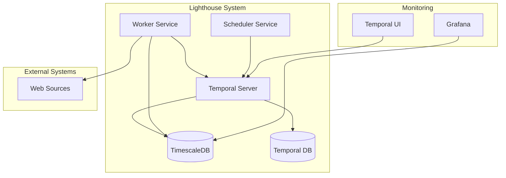
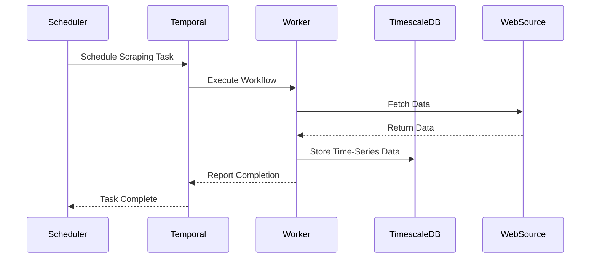
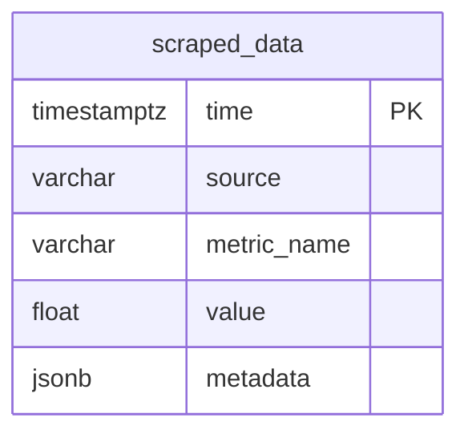
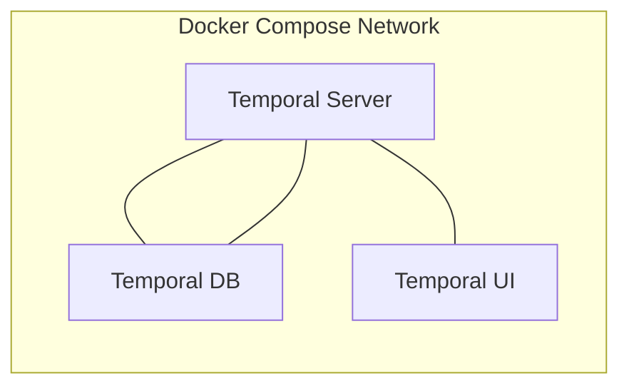
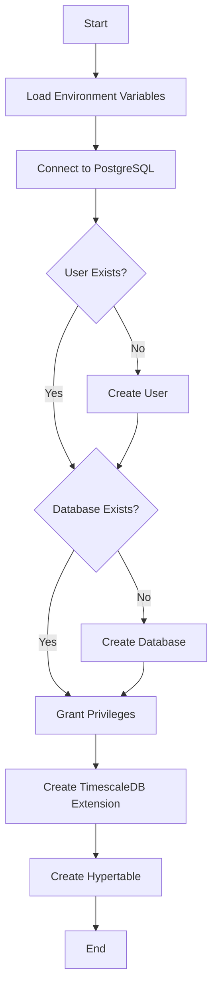

# Lighthouse Technical Documentation

## System Architecture

This project implements a scalable web scraping system using TimescaleDB for time-series data storage and Temporal.io for workflow orchestration.

### Architecture Overview



### Data Flow



## Component Documentation

### Database Configuration

The system uses TimescaleDB, a time-series database built on PostgreSQL, for data storage.

```typescript
/**
 * Database connection pool configuration
 * @module config/database
 */

/**
 * Creates and exports a PostgreSQL connection pool with TimescaleDB support
 * @example
 * import { pool } from './config/database';
 *
 * // Query example
 * const result = await pool.query(`
 *   SELECT time_bucket('1 hour', time) AS hour,
 *          avg(value) AS avg_value
 *   FROM scraped_data
 *   WHERE time > now() - interval '1 day'
 *   GROUP BY hour
 *   ORDER BY hour DESC;
 * `);
 */
export const pool = new Pool({
  host: process.env.DB_HOST,
  port: parseInt(process.env.DB_PORT || "5432"),
  database: process.env.DB_NAME,
  user: process.env.DB_USER,
  password: process.env.DB_PASSWORD,
})
```

### Temporal Workflow Configuration

```typescript
/**
 * Temporal client configuration and setup
 * @module config/temporal
 */

/**
 * Creates and returns a configured Temporal client
 * @returns {Promise<Client>} Configured Temporal client instance
 * @example
 * import { getTemporalClient } from './config/temporal';
 *
 * const client = await getTemporalClient();
 * const handle = await client.workflow.start(scrapingWorkflow, {
 *   taskQueue: 'scraping',
 *   workflowId: 'scrape-123',
 * });
 */
export async function getTemporalClient(): Promise<Client> {
  const connection = await Connection.connect({
    address: process.env.TEMPORAL_ADDRESS || "localhost:7233",
  })
  return new Client({
    connection,
    namespace: "default",
  })
}
```

## Database Schema

### Time-Series Data Table



The `scraped_data` table is configured as a TimescaleDB hypertable, optimized for time-series data:

```sql
-- Table Definition
CREATE TABLE scraped_data (
    time        TIMESTAMPTZ NOT NULL,
    source      VARCHAR(255),
    metric_name VARCHAR(255),
    value       DOUBLE PRECISION,
    metadata    JSONB
);

-- Convert to hypertable
SELECT create_hypertable('scraped_data', 'time');

-- Optional: Add indexes for common queries
CREATE INDEX idx_scraped_data_source ON scraped_data(source, time DESC);
CREATE INDEX idx_scraped_data_metric ON scraped_data(metric_name, time DESC);
```

## Setup and Deployment

### Prerequisites

- Docker and Docker Compose
- Node.js 16+
- PostgreSQL client (for direct DB access)

### Environment Configuration

```env
# Database Configuration
DB_HOST=localhost        # TimescaleDB host
DB_PORT=5432            # Database port
DB_NAME=lighthouse_db   # Database name
DB_USER=lighthouse_user # Database user
DB_PASSWORD=****        # Database password

# Temporal Configuration
TEMPORAL_ADDRESS=localhost:7233  # Temporal server address
```

### Container Architecture



### Initialization Process



## Development Guidelines

### Adding New Scrapers

1. Create a new activity file:

```typescript
/**
 * Scraper activity for specific data source
 * @module activities/customScraper
 */

/**
 * Scrapes data from a specific source
 * @param {string} url - Target URL to scrape
 * @param {Object} options - Scraping options
 * @returns {Promise<ScrapedData>} Scraped and processed data
 * @example
 * const data = await scrapeCustomSource('https://example.com', {
 *   interval: '5m',
 *   metrics: ['price', 'volume']
 * });
 */
export async function scrapeCustomSource(
  url: string,
  options: ScrapingOptions
): Promise<ScrapedData> {
  // Implementation
}
```

2. Create a corresponding workflow:

```typescript
/**
 * Custom scraping workflow definition
 * @module workflows/customWorkflow
 */

/**
 * Workflow that orchestrates custom scraping process
 * @param {WorkflowInput} input - Workflow configuration
 * @returns {Promise<WorkflowResult>} Workflow execution result
 * @example
 * const workflow = await client.workflow.start(customScrapingWorkflow, {
 *   taskQueue: 'scraping',
 *   workflowId: `scrape-${Date.now()}`,
 *   args: [{
 *     url: 'https://example.com',
 *     schedule: '*/5 * * * *'
 *   }]
 * });
 */
export async function customScrapingWorkflow(
  input: WorkflowInput
): Promise<WorkflowResult> {
  // Workflow implementation
}
```

### Error Handling

Implement comprehensive error handling:

```typescript
/**
 * Handles scraping errors with retry logic
 * @param {Error} error - The caught error
 * @param {RetryOptions} options - Retry configuration
 * @returns {Promise<void>}
 * @throws {ScrapingError} When max retries are exceeded
 */
async function handleScrapingError(
  error: Error,
  options: RetryOptions
): Promise<void> {
  // Implementation
}
```

## Monitoring and Maintenance

### Health Checks

```typescript
/**
 * Performs system health check
 * @returns {Promise<HealthStatus>} System health status
 * @example
 * const status = await checkSystemHealth();
 * if (!status.healthy) {
 *   notifyAdmins(status.issues);
 * }
 */
export async function checkSystemHealth(): Promise<HealthStatus> {
  // Implementation
}
```

### Performance Monitoring

Key metrics to monitor:

- Scraping success rate
- Data ingestion rate
- Query performance
- Resource utilization

## Security Considerations

### Data Protection

- All sensitive data is encrypted at rest
- Database connections use TLS
- Credentials are stored in environment variables
- Regular security audits are performed

### Access Control

- Principle of least privilege
- Role-based access control
- Regular credential rotation
- Audit logging

## Troubleshooting Guide

### Common Issues

1. Database Connection Issues

```typescript
/**
 * Diagnoses database connection issues
 * @returns {Promise<DiagnosticResult>} Connection diagnostic results
 */
async function diagnoseDatabaseConnection(): Promise<DiagnosticResult> {
  // Implementation
}
```

2. Scraping Failures

```typescript
/**
 * Analyzes scraping failures
 * @param {string} workflowId - Failed workflow ID
 * @returns {Promise<FailureAnalysis>} Analysis results
 */
async function analyzeScrapeFailure(
  workflowId: string
): Promise<FailureAnalysis> {
  // Implementation
}
```

## API Documentation

### Database Operations

```typescript
/**
 * Stores scraped data in TimescaleDB
 * @param {ScrapedData} data - Data to store
 * @returns {Promise<void>}
 * @example
 * await storeScrapedData({
 *   time: new Date(),
 *   source: 'example.com',
 *   metric_name: 'price',
 *   value: 100.50,
 *   metadata: { currency: 'USD' }
 * });
 */
export async function storeScrapedData(data: ScrapedData): Promise<void>
```

### Workflow Operations

```typescript
/**
 * Schedules a new scraping workflow
 * @param {ScheduleConfig} config - Scheduling configuration
 * @returns {Promise<string>} Workflow ID
 * @example
 * const workflowId = await scheduleScrapingWorkflow({
 *   cron: '*/15 * * * *',
 *   target: 'https://example.com',
 *   metrics: ['price', 'volume']
 * });
 */
export async function scheduleScrapingWorkflow(
  config: ScheduleConfig
): Promise<string>
```

## Contributing Guidelines

1. Code Style

- Use TypeScript
- Follow ESLint configuration
- Add JSDoc comments
- Write unit tests

2. Pull Request Process

- Create feature branch
- Add tests
- Update documentation
- Submit PR with description

## License

ISC License - See LICENSE file for details
