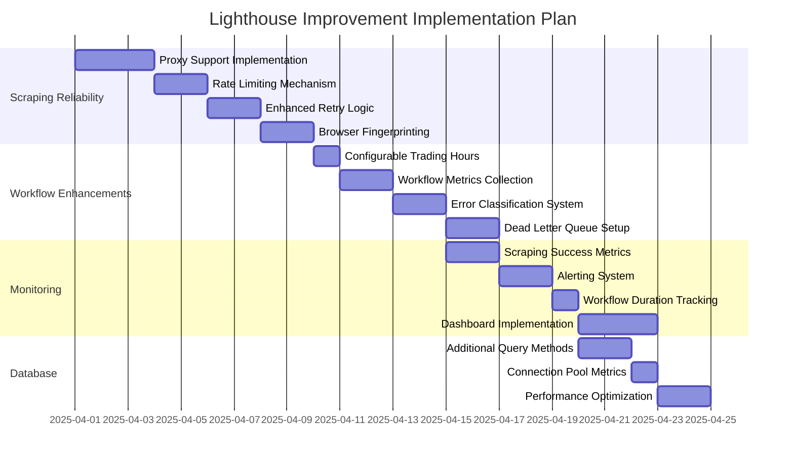

# Lighthouse Improvement Plan

## Overview
This document outlines the planned improvements for the Lighthouse stock market data scraping system, focusing on four key areas:
1. Scraping Reliability
2. Workflow Enhancements  
3. Monitoring
4. Database Improvements

## Implementation Timeline

## Detailed Implementation Phases

### Phase 1: Scraping Reliability (Highest Priority)

1. **Proxy Support Implementation**
   - Add proxy configuration to Puppeteer
   - Implement proxy rotation logic
   - Environment variables for proxy settings
   - Estimated: 3 days

2. **Rate Limiting Mechanism**
   - Add delay between requests
   - Configurable delay settings
   - Randomized delay within bounds
   - Estimated: 2 days

3. **Enhanced Retry Logic**
   - Exponential backoff for retries
   - Different retry strategies for different error types
   - Max retry configuration
   - Estimated: 2 days

4. **Browser Fingerprinting**
   - Randomize user agents
   - Implement viewport variations
   - Add cookie handling
   - Estimated: 2 days

### Phase 2: Workflow Enhancements

1. **Configurable Trading Hours**
   - Environment variable configuration
   - Timezone support
   - Multiple trading sessions support
   - Estimated: 1 day

2. **Workflow Metrics Collection**
   - Track workflow duration
   - Record success/failure rates
   - Store metrics in database
   - Estimated: 2 days

3. **Error Classification System**
   - Define error categories
   - Implement error classification
   - Add error metadata
   - Estimated: 2 days

4. **Dead Letter Queue Setup**
   - Configure Temporal dead letter queue
   - Implement error handling
   - Add notification system
   - Estimated: 2 days

### Phase 3: Monitoring

1. **Scraping Success Metrics**
   - Track success/failure rates
   - Record response times
   - Store metrics in database
   - Estimated: 2 days

2. **Alerting System**
   - Configure alert thresholds
   - Implement email/SMS notifications
   - Add escalation policies
   - Estimated: 2 days

3. **Workflow Duration Tracking**
   - Track workflow execution times
   - Identify bottlenecks
   - Store historical data
   - Estimated: 1 day

4. **Dashboard Implementation**
   - Set up Grafana dashboard
   - Configure key metrics visualization
   - Add alert indicators
   - Estimated: 3 days

### Phase 4: Database Improvements

1. **Additional Query Methods**
   - Add time-range queries
   - Implement metric comparison
   - Add aggregation methods
   - Estimated: 2 days

2. **Connection Pool Metrics**
   - Track pool usage
   - Monitor connection wait times
   - Add health checks
   - Estimated: 1 day

3. **Performance Optimization**
   - Review query plans
   - Optimize indexes
   - Add query caching
   - Estimated: 2 days

## Next Steps
1. Begin implementation of Phase 1 (Scraping Reliability)
2. Review and adjust timeline as needed
3. Monitor progress and adjust priorities